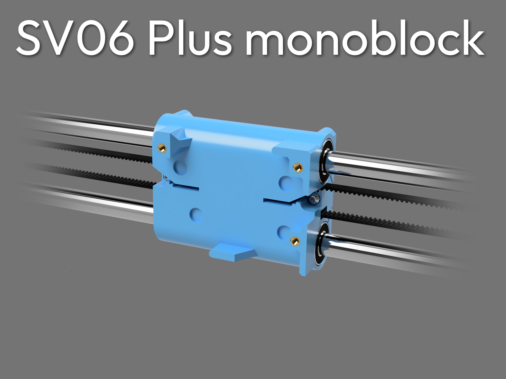

Shield: [![CC BY-NC-SA 4.0][cc-by-nc-sa-shield]][cc-by-nc-sa]

This work is licensed under a
[Creative Commons Attribution-NonCommercial-ShareAlike 4.0 International License][cc-by-nc-sa].

[![CC BY-NC-SA 4.0][cc-by-nc-sa-image]][cc-by-nc-sa]

[cc-by-nc-sa]: http://creativecommons.org/licenses/by-nc-sa/4.0/
[cc-by-nc-sa-image]: https://licensebuttons.net/l/by-nc-sa/4.0/88x31.png
[cc-by-nc-sa-shield]: https://img.shields.io/badge/License-CC%20BY--NC--SA%204.0-lightgrey.svg

A 1:1 replacement for the stock SV06 Plus carriage, printed in one piece!

With all the screw holes at the back retained for mod compatibility

This whole design sits within the stock footprint of the stock carriage, no more compatibility issues!

🤩 Do you like the design?

[Consider supporting me!](https://buymeacoffee.com/silencedfrost) It immensely help me design more models like this!

Submit feature requests [here!](https://trello.com/b/vacGVoLQ/cad-modelling-requests)

Features:
- Supports 4 LM10UU bearings or LM10LUU bearings
- Prints with minimal supports
- Belt lock
- Retains most mod compatibility

Recommended print settings:
- Nozzle diameter: 0.4mm
- Wall count: 4
- Line width: 0.45mm
- Tolerance requirement: 0.2mm
- Print orientation: as imported
- Supports: not required

Recommended materials:
 - PETG
 - ABS/ASA

Installation requires:
- 9 * M3 heatset inserts (3 mandatory, 6 optional)
- 5 * M3 x 8mm BHCS
- 2 * M3 x 4mm BHCS
- 5 * M3 nut
